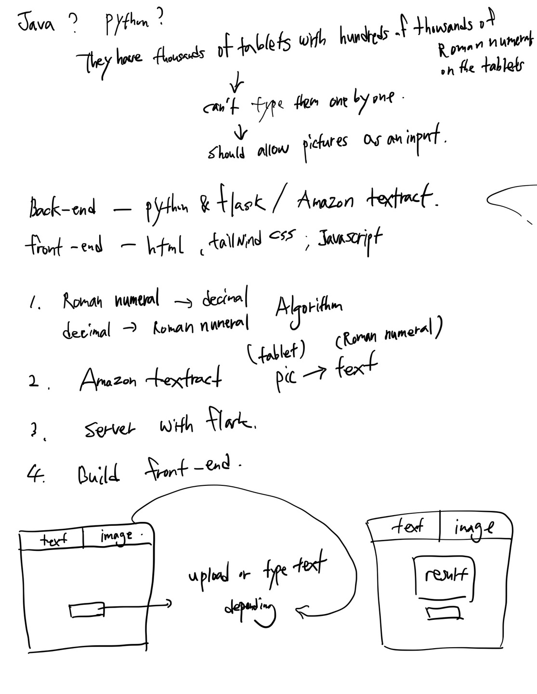

# Converter
 - Decimal to Roman Numeral and Roman Numeral to Decimal Converter

### Time spent:
 - The total time spent on completing this challenge was approximately 4 hours.

### Dependencies

- Flask
- Flask-CORS
- Boto3: Used for interacting with the AWS services, particularly for image processing with Amazon Textract.

### Implementation Details

- Added functionality to upload images and convert them to decimal numbers.
- Implemented Roman numeral to decimal conversion and vice versa.
- Integrated Flask backend to handle file uploads and conversions.
- Handled errors and exceptions to improve user experience.
- Implemented basic styling with CSS to improve the visual appeal of the web application.

### Future Improvements

- Enhance error handling to provide more informative error messages to the user.
- Improve the styling and layout of the web application for better user experience.
- Implement unit tests to ensure the reliability and robustness of the codebase.

## Project Note:

